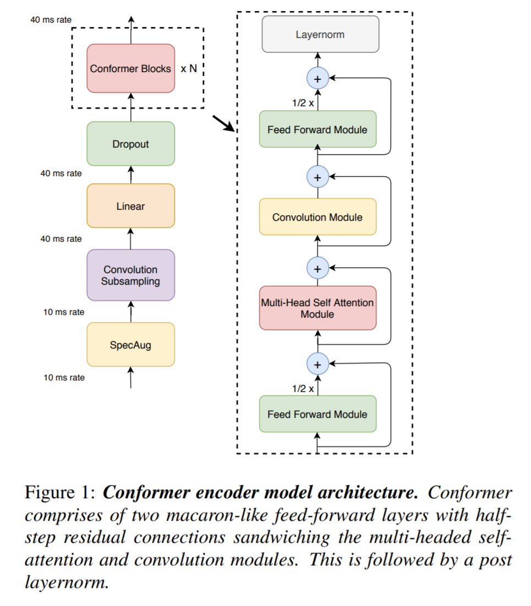

# Conformer


[](https://github.com/Rishit-dagli/Conformer/actions/workflows/linter.yml)
[](https://github.com/Rishit-dagli/Conformer/actions/workflows/python-publish.yml)
[](https://github.com/psf/black)
[](https://colab.research.google.com/github/Rishit-dagli/Conformer/blob/main/example/conformer-example.ipynb)

[](https://github.com/Rishit-dagli/Conformer/stargazers)
[](https://github.com/Rishit-dagli)
[](https://twitter.com/intent/follow?screen_name=rishit_dagli)

This repo implements [Conformer: Convolution-augmented Transformer for Speech Recognition](https://arxiv.org/abs/2005.08100) by Gulati et al. in TensorFlow. _**Conformer**_ achieves the best of both worlds (transformers for content-based global interactions and CNNs to  exploit local features) by studying how to combine convolution neural networks and transformers to model both local and global dependencies of an audio sequence in a parameter-efficient way.

It also significantly outperforms the previous Transformer and CNN based models achieving state-of-the-art accuracies.



## Installation

Run the following to install:

```sh
pip install conformer-tf
```

## Developing conformer-tf

To install `conformer-tf`, along with tools you need to develop and test, run the following in your virtualenv:

```sh
git clone https://github.com/Rishit-dagli/Conformer.git
# or clone your own fork

cd Conformer
pip install -e .[dev]
```

To run rank and shape tests run the following:

```sh
pytest --verbose
```

## Usage

In this section, I show a minimal example of creating a Convolutional Module, one of the main contributions of the paper and a Conformer block as well.

### Create a Convolutional Module

```py
import tensorflow as tf
from conformer_tf import ConformerConvModule

layer = ConformerConvModule(
    dim = 512,
    causal = False,             # whether it is auto-regressive
    expansion_factor = 2,       # what multiple of the dimension to expand for the depthwise convolution
    kernel_size = 31,
    dropout = 0.
)

x = tf.random.normal([1, 1024, 512])
x = layer(x) + x # (1, 1024, 512)
```

### Create a Conformer Block

```py
import tensorflow as tf
from conformer_tf import ConformerBlock

conformer_block = ConformerBlock(
    dim = 512,
    dim_head = 64,
    heads = 8,
    ff_mult = 4,
    conv_expansion_factor = 2,
    conv_kernel_size = 31,
    attn_dropout = 0.,
    ff_dropout = 0.,
    conv_dropout = 0.
)

x = tf.random.normal([1, 1024, 512])
conformer_block(x) # (1, 1024, 512)
```

## Want to Contribute 🙋‍♂️?

Awesome! If you want to contribute to this project, you're always welcome! See [Contributing Guidelines](CONTRIBUTING.md). You can also take a look at [open issues](https://github.com/Rishit-dagli/Conformer/issues) for getting more information about current or upcoming tasks.

## Want to discuss? 💬

Have any questions, doubts or want to present your opinions, views? You're always welcome. You can [start discussions](https://github.com/Rishit-dagli/Conformer/discussions).

## Citation

```bibtex
@misc{gulati2020conformer,
      title={Conformer: Convolution-augmented Transformer for Speech Recognition}, 
      author={Anmol Gulati and James Qin and Chung-Cheng Chiu and Niki Parmar and Yu Zhang and Jiahui Yu and Wei Han and Shibo Wang and Zhengdong Zhang and Yonghui Wu and Ruoming Pang},
      year={2020},
      eprint={2005.08100},
      archivePrefix={arXiv},
      primaryClass={eess.AS}
}
```

[Phil Wang's PyTorch implementation](https://github.com/lucidrains/conformer) was super helpful while building this.

## License

```
Copyright 2020 Rishit Dagli

Licensed under the Apache License, Version 2.0 (the "License");
you may not use this file except in compliance with the License.
You may obtain a copy of the License at

    http://www.apache.org/licenses/LICENSE-2.0

Unless required by applicable law or agreed to in writing, software
distributed under the License is distributed on an "AS IS" BASIS,
WITHOUT WARRANTIES OR CONDITIONS OF ANY KIND, either express or implied.
See the License for the specific language governing permissions and
limitations under the License.
```
